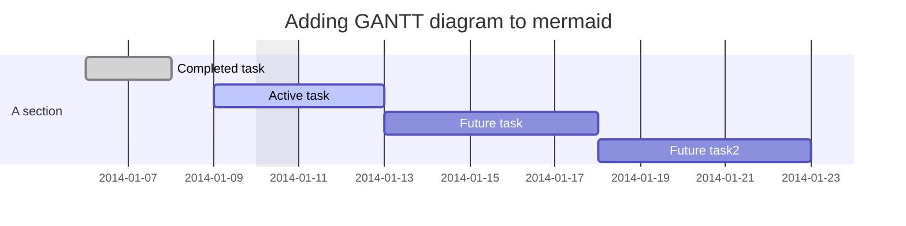
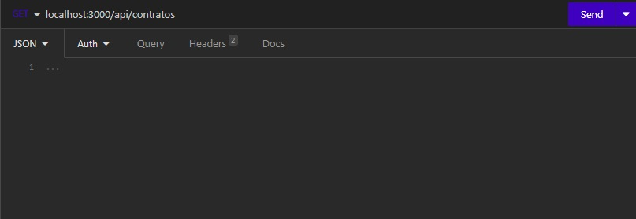
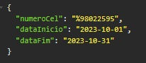

<div align="center">

<h1 style="border-bottom: none">
    <b><a href="#">ONNET API</a></b><br />
    API de Relatórios
    <br>
</h1>

<div align="center">

[](http://177.85.0.28:4000)

</div>

<p>
  A descrição a seguir é referente à API criada para a aplicação OnNet Relatórios <br />
  Nela, será apresentada toda a documentação da API, juntamente com o passo a passo para criar uma nova API, caso necessário.

> [!IMPORTANT]
> A Versão do Node.js utilizada foi a V20.9.0

</p>

</div>

<br />

## Iniciando...

> [!NOTE]
> ⚠️ A API ainda está em desenvolvimento, esta é apenas a documentação da mesma para fins de consulta e/ou dúvidas. ⚠️


<br />

> [!NOTE]
> <p align="center">
>   Os programas utilizados foram, Node.js, Visual Studio Code, HeidiSQL e Insomnia.<br />
>   Os pacotes utilizados foram o Express, Pg e Nodemon.
> </p>

## Progresso

- [X] Back-end com rotas e variáveis
- [X] Documentação completa do back, com formatação



## Rotas

- **/api/ClientesPorCaixa/** — Clientes por Caixa, essa rota recebe a caixa e busca todos os clientes que estão com ela no banco;

- **/api/comissaoTotal/** — Referente ao relatório de comissões do Comercial (Frente Loja) e Telemarketing *OBS: o PAP não entra pois ainda não havia um processo ou modo de buscar todas as vendas no sistema por não haver um usuário específico. Ele recebe o valor da comissão de TV, Telefonia, Pagamento Recorrente, Comissão de Renovação, Comissão de Upgrade, Data Inicial e Data Final (caso venha vazio, ele busca a data atual) dos operadores Frente de Loja e Telemarketing, com os valores específicos de cada setor. Segue abaixo os valores:

<p align="center">

 

  

</p>

- **/api/comissaoVenda/** — Referente ao relatório de comissão de vendas (Frente Loja) de todas as cidades (exceto Araguari, pois ainda não havia migrado os clientes pro mk) Ele recebe o valor da comissão de TV, Telefonia, Pagamento Recorrente, Comissão de Renovação, Comissão de Upgrade, Data Inicial e Data Final (caso venha vazio, ele busca a data atual) dos operadores Frente de Loja, com os valores específicos de cada setor. Segue abaixo os valores:

<p align="center">

 

</p>

- **/api/comissaoRenovacao/** — Referente ao relatório de comissão de renovações, upgrades e downgrades (Frente Loja e Telemarketing) de todas as cidades (exceto Araguari, pois ainda não havia migrado os clientes pro mk). Ele recebe o valor da comissão de TV, Telefonia, Pagamento Recorrente, Comissão de Renovação, Comissão de Upgrade, Data Inicial e Data Final (caso venha vazio, ele busca a data atual) dos operadores Frente de Loja e Telemarketing, com os valores específicos de cada setor. Segue abaixo os valores:

<p align="center">

 

  

</p>

- **/api/operators/** — Busca todos os operadores referente aos setores Comercial, SAC,Expedição, Telemarketing e Filiais (Excluindo os gestores, até a data de 07/11/2023);

- **/api/cidades/** — Busca todas as cidades que a empresa atendia até a data de 07/11/2023 (Abadia dos Dourados, Buritizeiro, Cruzeiro da Fortaleza, Guimarânia, Iraí de Minas, João Pinheiro, Lagoa Formosa, Patos de Minas, Patrocínio, Pirapora, Presidente Olegário, São Gonçalo do Abaeté, Três Marias, Varjão de Minas, Várzea da Palma);

- **/api/Abadia/** — Busca os vendedores (Frente Loja) de Abadia *(ketnenpaula138, danielasilva674)*;

- **/api/Buritizeiro/** — Busca os vendedores (Frente Loja) de Buritizeiro *(thaissouza673, robertabarbosa840)*;

- **/api/Cruzeiro/** — Busca os vendedores (Frente Loja) de Cruzeiro da Fortaleza *(luizavieira648, andressalemos657)*;

- **/api/Guima/** — Busca os vendedores (Frente Loja) de Guimarânia *(adrianecaixeta626, ellencristina667, larissaoliveira678)*;

- **/api/Irai/** — Busca os vendedores (Frente Loja) de Iraí de Minas *(claricepereira607, angelicalima645)*;

- **/api/JP/** — Busca os vendedores (Frente Loja) de João Pinheiro *(luanasouza177, rayssa133, kamillyramos133, eduardareis697, kamilagomes655)*;

- **/api/Lagoa/** — Busca os vendedores (Frente Loja) de Lagoa Formosa *(isabelsoares686, nathanimorais683)*;

- **/api/Patos/** — Busca os vendedores (Frente Loja) de Patos de Minas *(andressasouza650, anaflavia183, brunaeduarda622, danielasoares695, erikaalves646, janinemenezes655, renatalima694)*;

- **/api/Patrocinio/** — Busca os vendedores (Frente Loja) de Patrocínio *(jessicasilva619, annaclara621, larissasilva681)*;

- **/api/Pirapora/** — Busca os vendedores (Frente Loja) de Pirapora *(lorendannesantana605, robertamonti620)*;

- **/api/Presidente/** — Busca os vendedores (Frente Loja) de Presidente Olegário *(geovaniasilva127, alexarayane680, jessicavieira676)*;

- **/api/SaoGoncalo/** — Busca os vendedores (Frente Loja) de São Gonçalo do Abaeté *(guilhermealves600, jordanacristina679)*;

- **/api/3M/** — Busca os vendedores (Frente Loja) de TRês Marias *(joicepereira625, larissagabriela669, vanielelarisse637)*;

- **/api/Varjao/** — Busca os vendedores (Frente Loja) de Varjão de Minas *(keithhellen507, gabriellesilva630)*;

- **/api/Varzea/** — Busca os vendedores (Frente Loja) de Várzea da Palma *(alinerocha658, itamaralorrane622)*;

- **/api/SMSNumero/** — Recebe o nro de celular, a data inicial e a data final (caso venha vazio, ele busca a data atual) e retorna o cliente (caso tenha) que está recebendo os SMS's enviados;

- **/api/QntContratosAtivos/** — Recebe a data final (caso venha vazio, ele busca a data atual) e mostra a quantidade de contratos criados, cancelados e ativos em cada cidade;

- **/api/QntContratos/** — Recebe os dias de vencimento, a data inicial e a data final (caso venha vazio, ele busca a data atual) e retorna o dia vencimento e a quantidade de contratos criados com aquele vencimento, entre o período que foi informado (caso não tenha sido criado nenhum contrato com aquela data de vencimento, irá retornar o JSON vazio).

## Passo à Passo

O passo à passo a seguir foi inspirado no artigo: "Guia para Iniciantes: Criando uma API com Node.js, PostgreSQL e Padrão MVC"[^8]

### Passo 1:

Baixe e instale o Node.js[^1] e o Visual Code Studio[^2];

### Passo 2:

Crie uma pasta para que possa iniciar o projeto:

```
mkdir nome_da_pasta
```

### Passo 3:

Acesse a pasta:

```
cd nome_da_pasta
```

### Passo 4:

Acesse a pasta usando o VSCode e abra o terminal;

### Passo 5:

Dentro da pasta, inicie o projeto em Node.js:

```
npm init -y
```

### Passo 6:

Dentro da pasta, crie um arquivo chamado app.js:


### Passo 7:

Agora vamos instalar o Express:

```
npm install express
```

### Passo 8:

Agora vamos instalar o Express[^5]:

```
npm install express
```

### Passo 9:

Crie uma pasta com o nome config e, dentro dela, crie o arquivo db.js:


### Passo 10:

Instale o pacote Pg[^6], ele nos permite ter uma interface com o banco de dados PostgreSQL:

```
npm install pg
```

### Passo 11:

No arquivo db.js, coloque o código de acordo com o banco:

  #### Banco MK:

  ```
  const { Pool } = require('pg');

  // Configurações do banco de dados
  const pool = new Pool({
    user: '********', // Usuário de acesso do MK
    host: '********', // IP do Banco
    database: '********', // Nome do Banco
    password: '****', // Senha de acesso do MK
    port: 5432, // Porta padrão do PostgreSQL
    schema: "********", // Esquema de tabelas usadas no banco
    timeout: 360000 // Setando timeout para as consultas expirarem
  });
  
  module.exports = pool; //Exportando para usarmos posteriomente
  ```

  #### Banco MK Espelho:

  ```
  const { Pool } = require('pg');

  // Configurações do banco de dados
  const pool = new Pool({
    user: '********', // Usuário de acesso do MK Espelho
    host: '********', // IP do Banco
    database: '********', // Nome do Banco
    password: '********', // Senha de acesso do MK Espelho
    port: ********, // Porta padrão do PostgreSQL
    schema: "********", // Esquema de tabelas usadas no banco
    timeout: ******** // Setando timeout para as consultas expirarem
  });

  module.exports = pool; //Exportando para usarmos posteriomente
  ```
 
### Passo 12:

Crie as pastas "models", "controllers" e "views":

```
mkdir models controllers views
```


### Passo 13:

Dentro da pasta "model" crie o arquivo ContratoModel.js e cole o seguinte código:

```
const db = require('../config/db'); // Importe a configuração do banco de dados
 
const Contrato = { // pode colocar o nome que quiser, recomendo colocar o nome referente ao Model que irá usar
  getAllContracts: async () => { // esse async representa que essa é uma consulta assíncrona com o banco
    try {
      const query = 'SELECT * FROM mk_contratos LIMIT 10'; // Query SQL
      const result = await db.query(query); // await serve para que o código aguarde a consulta ser feita, para só após isso, ela ser enviada pro result
      return result.rows;
    } catch (error) {
     throw error;
    }
  }
};
 
module.exports = Contrato; // Exporta a constante Contrato, juntamente com a query para que possa ser usado em outros arquivos/pastas
```


### Passo 14:

Dentro da pasta "controller", crie o arquivo contractController.js e coloque o seguinte código:

```
const ContractModel = require('../models/ContractModel'); // Importe o modelo

const contractController = {
  getAllContracts: async (req, res) => {
    const { } = req.body;
    try {
      const contracts = await ContractModel.getAllContracts();
      res.status(200).json(contracts);
    } catch (error) {
      res.status(500).json({ error: 'Erro ao obter lista de contratos.' });
    }
  }
};
 
module.exports = contractController;
```


### Passo 15:

Abra o arquivo app.js e cole o seguinte código:

```
const express = require('express');
const db = require('./config/db');
const contractController = require('./controllers/contractController');
 
const app = express(); //Instância do Express
const PORT = 3000; //Porta para o servidor, por exemplo a 3000
 
app.use(express.json()); //Middleware para tratar os dados no formato JSON

app.get('/api/contratos', clienteController.getAllContracts); //Rota para obter todos os contratos

app.listen(PORT, () => {
  console.log(`Servidor na porta ${PORT}`);
}); 
```
 


### Passo 16:

Basicamente a API está pronta, para testarmos, recomendo baixar o Insomnia[^4], assim que baixar, crie uma workspace e uma coleção com o nome que desejar, volte para o VSCode e inicie o servidor com o comando:

```
node app.js
```

Assim que iniciar o servidor, ele irá aparecer isso:


Caso não apareça, verifique seu código para confirmar que não digitou nada errado
Após validar o código e iniciar o servidor, vá no Insomnia e selecione o tipo de requisição como GET e cole a rota que você acabou de criar



Clique em Send, irá retornar o JSON referente a sua query:
 


### Passo 17:

Com tudo funcionando, nós temos um problema, toda vez que uma alteração for feita no código, teremos que derrubar o servidor e iniciar novamente, para corrigirmos isso acesse o Nodemon[^7], e encontre o código para baixál-lo:

```
npm install -g nodemon
```

Assim que instalar, acesse o arquivo package.json e adicione a seguinte linha, abaixo do "test":

```
"dev": "nodemon app.js"
```


Após realizar esse processo, agora utilize o comando:

```
npm run dev
```

Com esse comando, nós startamos o servidor e, graças ao nodemon, todas as alterações que fizermos e salvarmos no código, serão automaticamente enviadas para o Insomnia enquanto estivermos testando as rotas, sem a necessidade de derrubar e subir novamente o servidor.

### Extras:

Passei algumas dificuldades procurando como fazer oara que a requisição passasse alguma variável, segue abaixo o código referente ao Model:

```
getClientWithCelNumer: async (numeroCel, dataInicio, dataFim) => { // as variáveis devem vir aqui
   try {
      const query =
      "SELECT\n"+
      "DISTINCT SMS.DESTINATARIO as \"Nro Destinatário\",\n"+
      "CLIENTE.NOME_RAZAOSOCIAL as \"Nome do Cliente\",\n"+
      "SMS.DT_HR AS \"Data Envio\"\n"+
      "FROM\n"+
       "MK_SMS_03_HISTORICO SMS\n"+
      "INNER JOIN MK_PESSOAS CLIENTE ON (CLIENTE.CODPESSOA = SMS.CD_CLIENTE)\n"+
      "WHERE\n"+
      "SMS.DESTINATARIO like $1\n"+ // Esse $1 representa a 1ª variável
      "AND DT_HR BETWEEN $2 AND $3\n"+ // Esse $2 representa a 2ª variável e o $3, a 3ª
      "ORDER BY 3 DESC";
      const values = [numeroCel,dataInicio,dataFim]; // aqui, declaramos esse array, apenas para receber todas as variáveis
      const result = await db.query(query, values); // quando for enviado para o banco, irá a query, juntamente com o array de variáveis
      return result.rows;
    } catch (error) {
      throw error;
    }
}
```

Segue agora o código referente ao Controller:

```
getClientWithCelNumer: async (req, res) => {
    const { numeroCel, dataInicio, dataFim } = req.body; // requisições vindas do body(Insomnia)
    try {
      const operators = await MKModel.getClientWithCelNumer(numeroCel, dataInicio, dataFim); // variáveis para ser enviadas para o Model
      res.status(200).json(operators); // Mostra o resultado no Insomnia como JSON
    } catch (error) {
      res.status(500).json({ error: "Erro ao obter cliente/número."+error });
    }
}
```

Para que possamos passar a requisição, pode ser no formato que achar melhor, no exemplo, eu usei JSON:



E, como resultado, tivemos:


Agora, caso seja necessário uma requisição com Array, segue o seguinte código abaixo, a validação que fiz foi apenas no Controller:

```
getAllQntContratos: async (req, res) => {
    const { diasVencimento, dataInicio, dataFim } = req.body;
    const operators = [];
    try {
      for(var i=0;i<diasVencimento.length;i++){
        operators[i] = await MKModel.getAllQntContratos(diasVencimento[i], dataInicio, dataFim);
      }
      res.status(200).json(operators);
    } catch (error) {
      res.status(500).json({ error: "Erro ao obter relatório. "+error });
    }
  }
```

Segue também a requisição feita:


> [!WARNING]
> No exemplo foi usado um array de inteiros, caso o seu array seja de Strings, então basta colocar aspas em cada valor. Exemplo: ["A","B","C","D"]

## Referências

[^1]: [Node JS](https://nodejs.org/en)

[^2]: [Visual Code Studio](https://code.visualstudio.com)

[^3]: [Programa HeidiSQL](https://www.heidisql.com/download.php)

[^4]: [Programa Insomnia](https://insomnia.rest/download)

[^5]: [Pacote Express](https://expressjs.com)

[^6]: [Pacote Pg](https://www.npmjs.com/package/pg)

[^7]: [Pacote Nodemon](https://www.npmjs.com/package/nodemon)

[^8]: [Guia para Iniciantes: Criando uma API com Node.js, PostgreSQL e Padrão MVC](https://dev.to/matt1cs/guia-para-iniciantes-criando-uma-api-com-nodejs-postgresql-e-padrao-mvc-4027)


